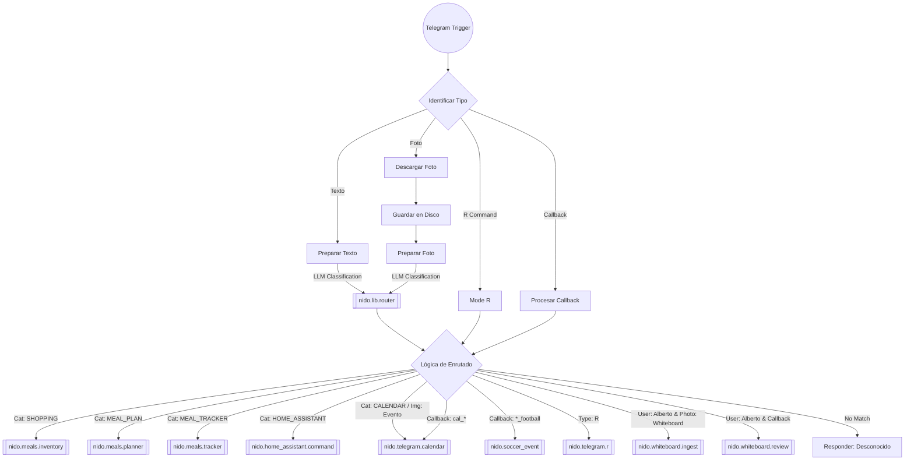

# 🔀 Lógica de Enrutado y Workflows

Este documento describe cómo se procesan y enrutan los mensajes entrantes desde Telegram hacia los diferentes workflows funcionales del sistema.

## 🗺️ Diagrama de Flujo Global

## 🧩 Componentes Principales

### 1. `nido.router.telegram`
Es el punto de entrada principal. Recibe todos los mensajes (texto, fotos, callbacks) del bot de Telegram.
- **Identificación**: Determina si el mensaje es texto, una foto, un comando especial 'R' o un callback de un botón interactivo.
- **Pre-procesamiento**: Descarga las fotos al disco local si es necesario.
- **Clasificación**: Delega en `nido.lib.router` para entender la intención del usuario mediante LLM.
- **Decisión**: El nodo "Route Logic" aplica las reglas de negocio para elegir el workflow destino.

### 2. `nido.lib.router`
Librería reutilizable que clasifica el input del usuario.
- Usa `nido.lib.llm_adapter` para consultar a un LLM.
- Clasifica el texto o imagen en categorías como `SHOPPING`, `MEAL_PLAN`, `CALENDAR`, `HOME_ASSISTANT`, etc.

### 3. Workflows Funcionales (Destinos)
Son los encargados de realizar la acción final.

| Categoría / Regla | Workflow ID | Descripción |
|-------------------|-------------|-------------|
| `SHOPPING` | `nido.meals.inventory` | Gestión de inventario y lista de la compra. |
| `MEAL_PLAN` | `nido.meals.planner` | Planificación de comidas semanales. |
| `MEAL_TRACKER` | `nido.meals.tracker` | Registro de comidas consumidas. |
| `HOME_ASSISTANT` | `nido.home_assistant.command` | Control de dispositivos HA (luces, aspiradora, etc.). |
| `CALENDAR` | `nido.telegram.calendar` | Gestión de eventos en el calendario (Google Calendar). |
| `R` (Comando) | `nido.telegram.r` | Funcionalidad rápida "R" (Recordatorios/Notas rápidas). |
| Callback `*_football` | `nido.soccer_event` | Gestión de asistencia a partidos de fútbol. |
| `WHITEBOARD` | `nido.whiteboard.ingest` | Procesa fotos de la pizarra de la cocina (Solo Alberto). |

## 📏 Reglas de Enrutado Detalladas

Las reglas se evalúan en orden en el nodo `Route Logic`.

1. **Comando R**: Si el texto es exactamente "r" o "R" → `nido.telegram.r`.
2. **Globales por Categoría (LLM)**:
   - `SHOPPING` → `nido.meals.inventory`
   - `MEAL_PLAN` → `nido.meals.planner`
   - `MEAL_TRACKER` → `nido.meals.tracker`
   - `HOME_ASSISTANT` → `nido.home_assistant.command`
   - `CALENDAR` → `nido.telegram.calendar`
3. **Globales por Imagen**:
   - Tipo `event` → `nido.telegram.calendar`
   - Tipo `meal_tracker` → `nido.meals.tracker`
4. **Callbacks Específicos**:
   - `cal_*` (ej. `cal_save`) → `nido.telegram.calendar`
   - `yes_football` / `no_football` → `nido.soccer_event`
5. **Reglas de Usuario (Alberto)**:
   - Categoría `WHITEBOARD` o imagen `whiteboard_calendar` → `nido.whiteboard.ingest`
   - Cualquier callback de Alberto (no capturado antes) va a `nido.whiteboard.review` (revisión de pizarra).
